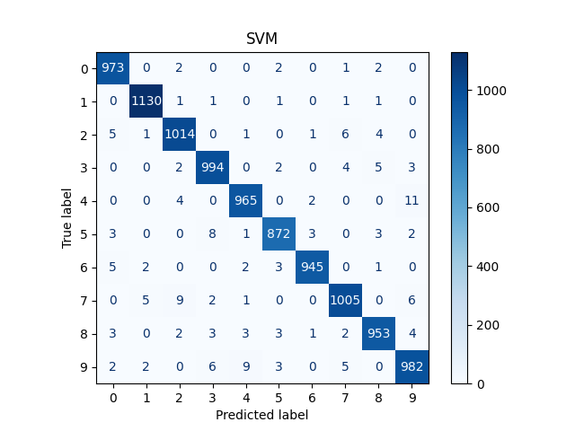
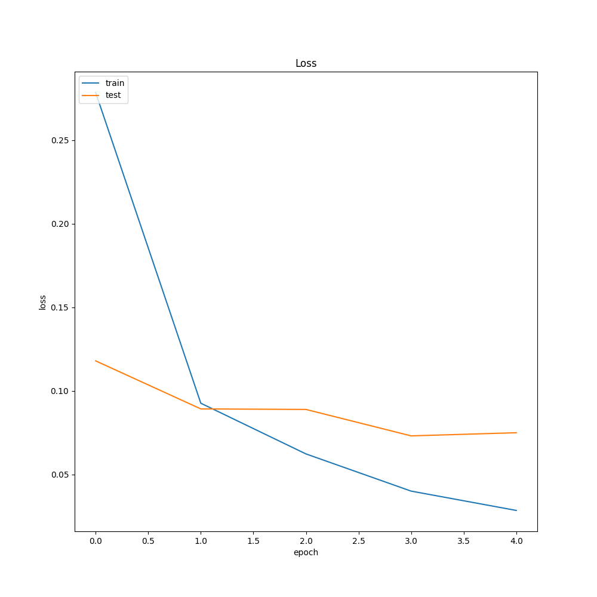
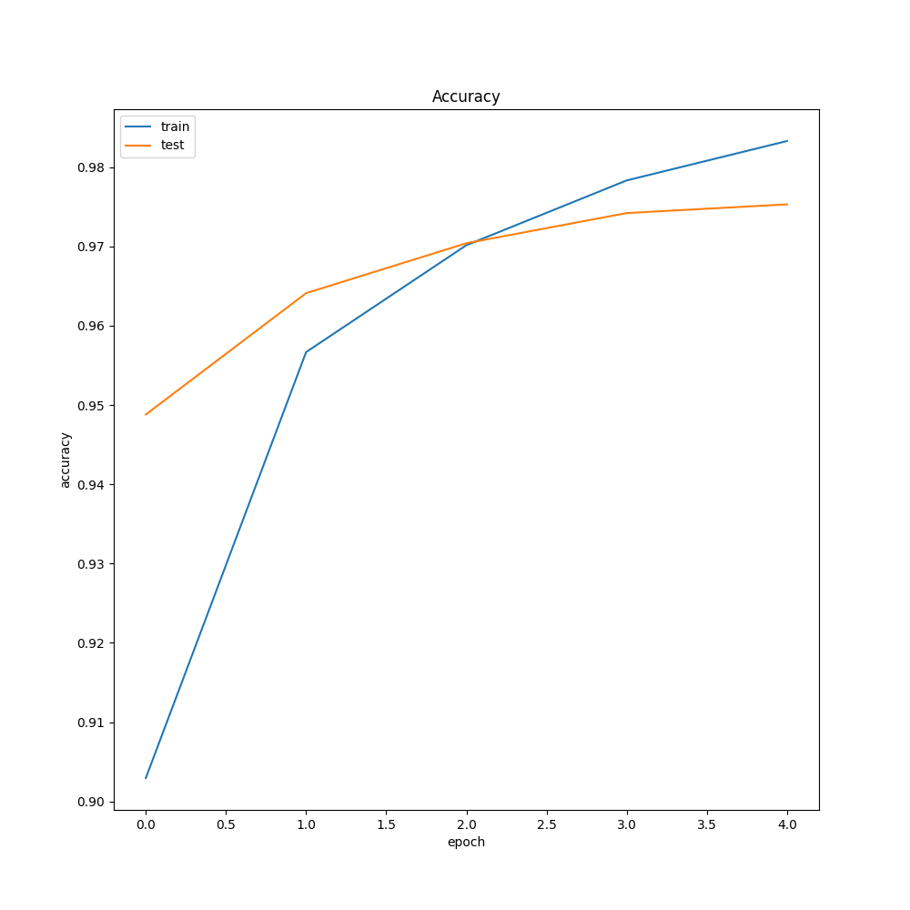
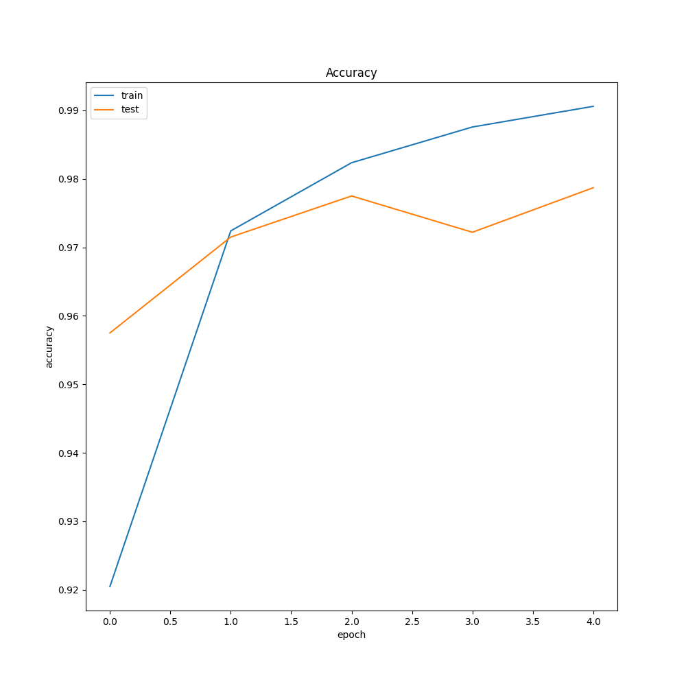
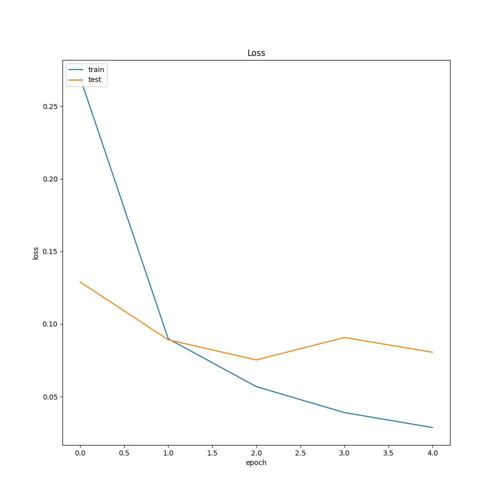
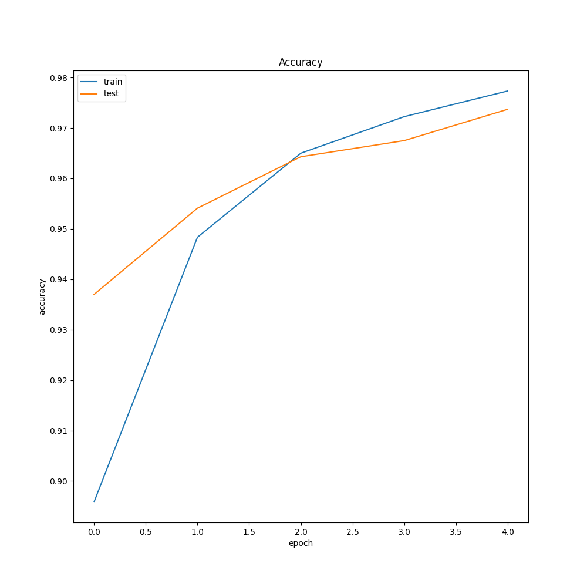
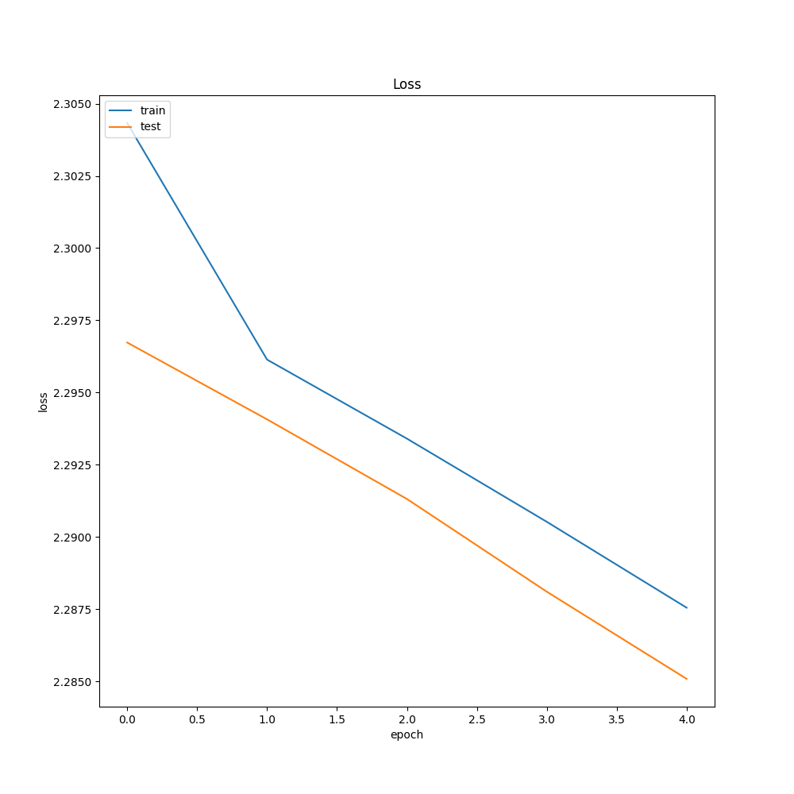
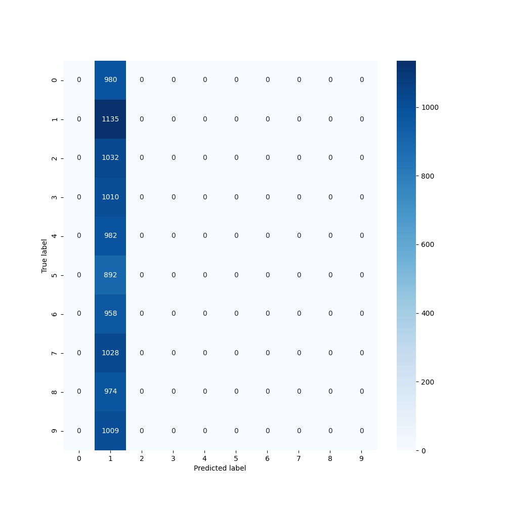
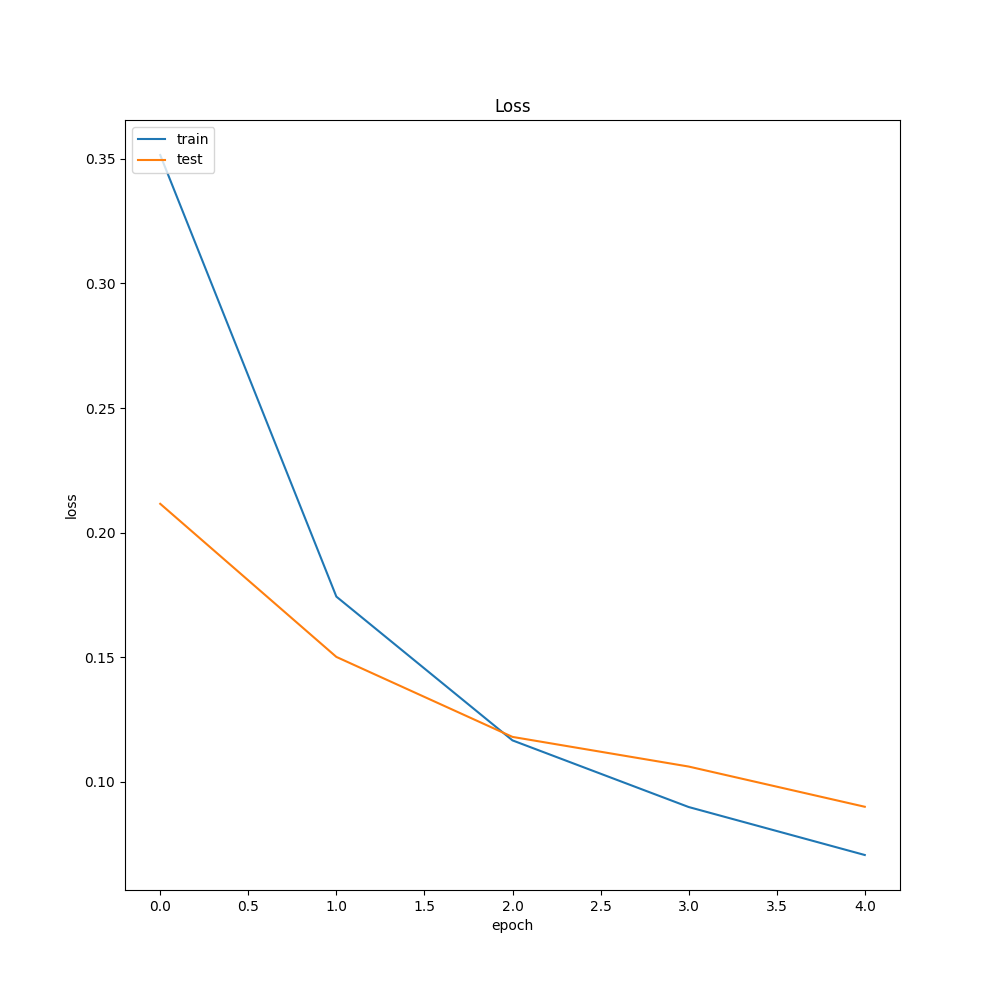
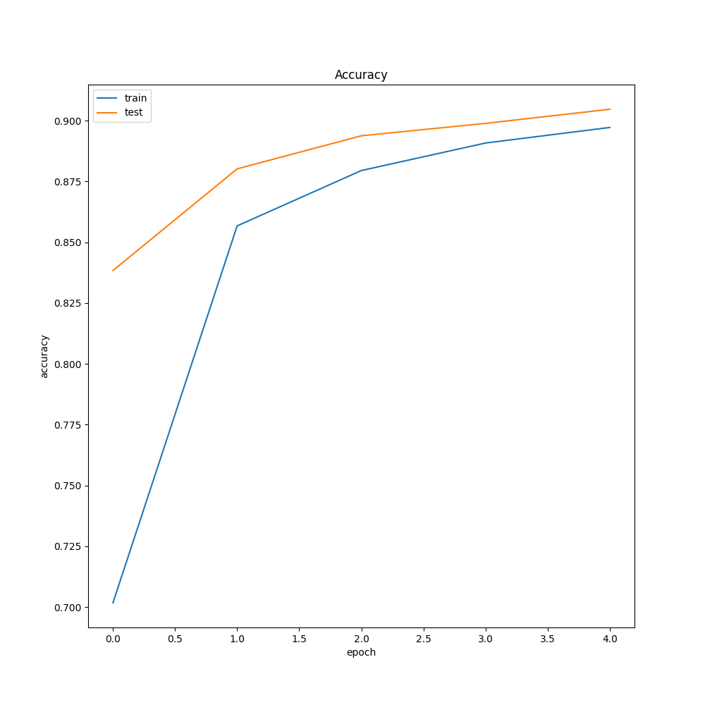

# Deep Learning Deep Learning
A concise study on the hyperparameters of Deep Neural Networks

## Team:
- [Varun Parthasarathy](https://github.com/varun-parthasarathy)
- [Siddarth Gopalakrishnan](https://github.com/siddarthgopalakrishnan)
- [Sivaraman Karthik Rangasai](https://github.com/karthikrangasai)

## Common Deep Learning Model Parameters:
- Dataset used : MNIST
- Batch size : 256
- Optimizers : Adam, SGD
- Number of epochs : 5

## I. Machine Learning vs Deep Learning:
- *`Machine Learning`* is a field of Artificial Intelligence that studies computer algorithms that learn to improve through experience. The sub-field of Machine Learning, *`Supervised Learning`*, is of more importance to us here. This branch of Machine Learning learns from labeled training data, which can be seen as a higher-order form of function approximation. Supervised learning algorithms solve minimization optimization problems to reduce the error between its output prediction and the actual output.
- The only issue with Machine Learning algorithms is that a domain expert must provide the best features required, which the algorithm can use in order to learn well from the data. This particular step of the Machine Learning workflow is where the maximum time is spent in order to obtain the most abstracted features for the model to generalize its learning. A general approach for this issue was the use of Autoencoders, which produces a different representation of the input data using encoders. This method was also referred to as *`Representational Learning`*.
- Although Representational Learning methods produce different representations of the features, they don't seem to be abstracted enough for the model to generalize well.
    - Example 1: For image recognition problems, the angle, projection, color, and brightness of the image must not vary the output prediction of the model by a large factor.
    - Example 2: In speech recognition problems, the accent, pitch, and tone must not vary the output prediction of the model by a large factor.
- *`Deep Learning`* solves this central problem in representation learning by introducing representations that are expressed in terms of other, simpler representations. It performs feature engineering by itself, thus producing better and abstracted features and lets the model learn the optimal representations by itself. Deep learning combines feature extraction and classification and attempts to learn the representations by using a hierarchy of layers. From a deep learning model's perspective, each layer of the model is supposed to be the better representation of the features represented by the previous layer. This is a different paradigm in itself compared to the rule-based and the classical machine learning paradigm.

## II. Machine Learning models being compared to:
All the ML models considered are supervised learning models, which learn from labeled training data in order to predict labels for unseen test data.
All the models have been implemented using the sklearn python module, which consists of various classification, regression, and clustering algorithms and also contains various preprocessing tools at our disposal.
In order to tune the hyperparameters of the functions, we have used GridSearchCV, which is a part of the sklearn.model_selection library. This method performs an exhaustive search over all possible combinations of parameter values for a classifier. We pass a directory of parameters and the possible values they can take along with the classifier to the method, which returns the best possible parameters as an attribute called best_params_, based on some scoring rubric.

### 1. Support Vector Machines
- Accuracy: 0.9833
- Optimal Hyperparameters: C -> 10, gamma -> 0.01, kernel -> rbf
- Explanation: 
    - SVM is one of the most popular algorithms which analyzes data for classification and regression analysis.
    - There are two primary parameters that influence the accuracy of the SVM classifier: the C value and the gamma parameter. 
    - The C value is the regularization parameter, which determines how much we want our classifier to misclassify each training example. It, therefore, impacts the margin of the hyperplane. A small value of C will take a larger margin even if it misclassifies some training examples and vice-versa.
    - We also compared a linear model to a non-linear model using default parameters, which resulted in the non-linear model ('RBF' kernel), giving better accuracy.
    - For the non-linear model, we must consider another important parameter, which is the gamma value of the kernel. The gamma value defines how far does a single training example influences. If the gamma value is too small, the model can't capture the complexity of the shape of the data. This will result in a more or less linear model. If gamma is too high, we might overfit our model.
    - Finally, on applying these parameters to our model, we got an accuracy of 0.9833 with an average f1-score of 0.98.

### 2. Random Forest
- Accuracy : 0.9698
- Optimal Hyperparameters : criterion -> gini, max-depth -> None, min-samples-leaf -> 1, min-weight-fraction-leaf -> 0.0, n-estimators -> 100
- Explanation: 
    - Random Forest is an ensemble learning method that fits a number of decision trees on various samples of our dataset and gives output based on some averaging criteria of the individual trees.
    - The parameters are all the same as the Decision Tree classifier with an additional parameter n_estimators, which determines the number of trees we want in our forest. More number of trees in the forest leads to better accuracy but can be computationally heavy.
    - Finally, on applying these parameters to our model, we got an accuracy of 0.9698 with an average f1-score of 0.97.

### 3. Logistic Regression
- Accuracy : 0.9256
- Optimal Hyperparameters : penalty -> l2, solver -> lbfgs, max-iter -> 1000
- Explanation: 
    - This model classifies the input into a pass/fail class. It outputs a binary classification which is implemented in a one-v-all way for multi-class classification.
    - One parameter affects the convergence rate and accuracy of the model, which is 'solver.'
    - The solver function is used for an optimization problem where some solvers are used for the L1 penalty, whereas some work better on the L2 penalty condition.
    Our model has used L2 norm penalization and hence chosen the solver parameter out of lbfgs, sag, or saga.
    - Finally, on applying these parameters to our model, we got an accuracy of 0.9256 with an average F1-score of 0.92.

### 4. Decision Trees
- Accuracy : 0.8868
- Optimal Hyperparameters : criterion -> entropy, max-depth -> None, min-samples-leaf -> 1, min-weight-fraction-leaf -> 0.0
- Explanation: 
    - Random Forest is an ensemble learning method fits a number of decision trees on various samples of our dataset and gives output based on some averaging criteria of the individual trees.
    - There are quite a few parameters to optimize for this classifier, namely, criterion, max_depth, min_samples_leaf, min_weight_fraction_leaf, and n_estimators.
    - The max_depth parameter specifies the maximum depth of the tree. The default value for max_depth is None, which means that the tree will expand until every leaf has all data from the same class. The higher the value, the more the chance of overfitting the data.
    - The min_samples_leaf parameter is another stopping criterion that specifies the minimum number of samples required to be at a leaf node. The default value for this parameter is 1, which means that every leaf must have at least 1 sample that it classifies. Having high values for this parameter might capture more variance in the samples, whereas lower values may tend to overfit the data.
    - The criterion parameter is used for information gain. This parameter measures the impurity (multiple classes) of a node in the tree.
    - The min_weight_fraction_leaf parameter is the minimum weighted fraction of the input samples required to be at a leaf node. This assumes uniform weights as we haven't provided sample weight in our fit method. This is similar to min_samples_leaf, but it uses a fraction of the sum total number of observations instead.
    - Finally, on applying these parameters to our model, we got an accuracy of 0.8868 with an average f1-score of 0.88.

### 5. F1 Scores for all Models:
| Algorithm |`Label 0` | `Label 1` | `Label 2` | `Label 3` | `Label 4` | `Label 5` | `Label 6` | `Label 7` | `Label 8` | `Label 9` |
| :---------: | :---------: | :---------: | :---------: | :---------: | :---------: | :---------: | :---------: | :---------: | :---------: | :---------: |
| Support Vector Machine | 0.99 | 0.99 | 0.98 | 0.98 | 0.98 | 0.98 | 0.99 | 0.98 | 0.98 | 0.97 |
| Random Forest | 0.98 | 0.99 | 0.96 | 0.96 | 0.97 | 0.97 | 0.98 | 0.97 | 0.96 | 0.96 |
| Logistic Regression | 0.96 | 0.97 | 0.91 | 0.91 | 0.94 | 0.88 | 0.95 | 0.93 | 0.88 | 0.91 |
| Decision Trees | 0.93 | 0.96 | 0.88 | 0.85 | 0.87 | 0.83 | 0.90 | 0.91 | 0.84 | 0.86 |

### 6. Comparison between their performances:
- Among the machine learning models, we got the best accuracy of around 98% from our Support Vector Machine classifier. The support vector machine model fits a multiclass model by using a one vs. all approach. This also results in the training of the classifier, a computationally expensive task. Our training error becomes negligible when fitting our model with the best parameters we receive from the Grid Search method while also fitting the testing data. We get an average f1 score of 0.98, which shows that our model has predicted the labels for the test data quite accurately.
- For our decision trees model, we see that our accuracy is only around 88%. One of the primary reasons for this may be that the model might have overfitted our training data according to the best parameter values of the grid search. But we know that Decision trees are greedy, due to which overfitting is a common issue. To compensate for this low accuracy, we either boost the decision tree or use an ensemble method, namely Random Forest classification.
- For our random forest model, we take an ensemble with 100 decision trees, which improves our accuracy drastically to about 97%. We also observe that the f1 score of our random forest classifier is 0.97, which is almost the same as that of our support vector machine model. On running grid search on the parameters, the optimal parameters obtained, again tend to overfit quite a bit, but in spite of this, it fits our test dataset really well.
- Although our random forest model performs better than Decision trees and almost close to our support vector machine models, we can't always classify one model to be better than the other. With almost similar parameters, the accuracy of our models depends more on the task at hand. In general, the SVM classifier tends to work better in the absence of outliers and in a binary classification problem. Meanwhile, random forest models are known to perform better in multiclass classification tasks and don't lower it's performance much in the presence of outliers. But as in the case of decision trees, there are many instances where random forests also tend to overfit our training data, thus reducing the accuracy, compared to its potential accuracy, on the test set.
- Our final model is the logistic regression model. This model, similar to the Support vector machine model, adopts a one vs. all method to classify the output in a multiclass classification task. We obtain an accuracy of 92%, which is fairly better compared to our decision tree model but still lacks a bit compared to our SVM model. The reason for this is that Logistic regression works best in a binary classification environment and doesn't fair as well as our support vector machine classifier in multiclass scenarios. This could be due to the fact that there aren't many trainable hyperparameters, to begin with as compared to the support vector machine classifier. Our model also ensures that it doesn't overfit the training dataset by making the use of L2 norm penalization. Due to these factors, we also obtain a fairly decent f1 score of 0.92, which signifies that it has predicted the output labels quite accurately.
- We must also note that, as mentioned before, we can not generalize the performance of these models solely based on the accuracy in one task. According to the No Free Lunch Theorem, there is no one model that works best for all the tasks at hand. The efficiency of the model depends on various factors, from task to task. This also includes the randomness in the process of hyperparameter tuning, which again depends on a lot of factors such as the number of KFolds, number of input parameters, etc.

### 7. Machine Learning Model Graphs
| Algorithms | Training & Cross-validation score | Confusion Matrix |
| :---------: | :---------: | :---------: |
| Support Vector Machine |  |  |
| Random Forest |  |  |
| Logistic Regression |  |  |
| Decision Trees |  |  |

## III. Deep Learning Model Descriptions
### 1. Different Activation Functions:
- Model 1 :(784, input) -> (512, relu) -> (10, softmax)
- Model 2 :(784, input) -> (512, sigmoid) -> (10, softmax)
- Model 3 : (784, input) -> (512, tanh) -> (10, softmax)
- Explanation:
	- When comparing the use of different activation functions for hidden layers, we observe that the ReLU activation performs the best, followed by the tanh function and finally the sigmoid function. 
    - The reason for this is that sigmoid units tend to saturate and kill gradients, which is why it is never used in hidden layers; as it provides outputs between 0 and 1, it is suited as the output layer for binary classification problems only. Also, the outputs of the sigmoid function are not zero-centered. This is undesirable since neurons in later layers of processing in a neural network would be receiving data that is not zero-centered. This has implications on the dynamics during gradient descent, because if the data coming into a neuron is always positive `(e.g. x>0 elementwise in  f=wTx+b))`, then the gradient on the weights `w` will during backpropagation become either all be positive, or all negative (depending on the gradient of the whole expression f). This could introduce undesirable  zig-zagging dynamics in the gradient updates for the weights. 
    - Even though the tanh function saturates as well, it still performs relatively better than the sigmoid  function as it is zero-centered.
    - The ReLU activation performs best as it does not suffer from any such issues. We must note, however,  that the ReLU activation can lead to dead neurons - the gradient into a neuron can cause it to never activate for any input thereafter. Solutions to this include modifying the ReLU function to allow small negative values; we will not touch upon this here as we do not face this issue.

| Graph Type | Model 1 - ReLU - 1 Layer | Model 2 - Sigmoid - 1 Layer | Model 3 - Tanh - 1 Layer |
| :--------: | :-------: | :-------: | :-------: |
| Accuracy |  |  |  |
| Loss |  |  |  |
| Confusion matrix |  |  |  |

### 2. Different number of hidden units per layer keeping numbers of layers and activation functions same:
- Model 4 : (784, input) -> (512, relu) -> (256, relu) -> (128, relu) -> (10, softmax)
- Model 5 : (784, input) -> (512, tanh) -> (256, tanh) -> (128, tanh) -> (10, softmax)
- Model 6 : (784, input) -> (512, sigmoid) -> (256, sigmoid) -> (128, sigmoid) -> (10, softmax)
- Explanation:
	- It can be observed here that in general, as the number of layers increases (the neural network becomes deeper), accuracy increases as well if the activation function is suited for the role. This is studied in more detail in the next section.
    - It is difficult to deterministically comment on the number of hidden units per layer in general.  This is because some applications benefit from having different numbers of neurons in subsequent layers, whereas others may benefit from having the same number of neurons in each hidden layer. The next section examines this in more detail.
    - We can also observe the effect of the choice of activation function in more detail here. We clearly observe that the ReLU function outperforms the tanh and sigmoid functions, while the sigmoid function performs even poorer than when it was used in the previous section (single hidden layer activation).

| Graph Type | Model 4 - ReLU - 3 Layer | Model 5 - Tanh - 3 Layer | Model 6 - Sigmoid - 3 Layer |
| :--------: | :-------: | :-------: | :-------: |
| Accuracy |  |  |  |
| Loss |  |  |  |
| Confusion matrix |  |  |  |

### 3. Different number of layers:
- Model 7 : (784, input) -> (10, softmax)
- Model 8 : (784, input) -> (387, relu) -> (10, softmax)
- Model 9 : (784, input) -> (387, relu) -> (387, relu) -> (10, softmax)
- Model 10 : (784, input) -> (387, relu) ->  (387, relu) -> (387, relu) ->(10, softmax)
- Explanation:
	- Here, we can definitely observe that as the number of hidden layers increases, the accuracy also increases. We must note, however, that making a neural network too deep could also pose issues such as overfitting. Thus, some form of regularization is required to prevent this. Since we do not train for too long, we do not face this problem.
    - Having too many layers does not noticeably improve performance - it tapers off. This is because the ReLU activation allows the neural network to easily learn the identity function in deeper layers.
    - We can also observe that having the same number of units in each layer does not noticeably improve performance compared to varying the number of units per layer. Again, we must note that this depends on the application - different data distributions may require different model architectures.

| Graph Type | Model 7 - 0 Layers | Model 8 - 1 Layer | Model 9 - 2 Layers | Model 10 - 3 Layers |
| :---------: | :---------: | :---------: | :---------: | :---------: |
| Accuracy |  |  |  |  |
| Loss |  |  |  |  |
| Confusion matrix |  |  |  |  |

### 4. Different ordering of the hidden units sizes:
- Model 11 : (784, input) -> (128, tanh) -> (256, tanh) -> (512, tanh) -> (10, softmax)
- Model 12 :(784, input) -> (128, relu) -> (256, relu) -> (512, relu) -> (10, softmax)
- Explanation:
	- Here, we observe that increasing the number of hidden units per layer (essentially inflating the vector space) causes performance to drop.
    - This is because transforming data from a lower dimensional vector space to a higher dimensional space also involves the addition of either noise or sparsity, which reduces how effectively the neural network can learn the corresponding weights.
    - This also has a slight regularizing effect due to the noise; however, this type of model is not generally recommended except for autoencoder architectures.

| Graph Type | Model 11 | Model 12 |
| :---------: | :---------: | :---------: |
| Accuracy |  |  |
| Loss |  |  |
| Confusion matrix |  |  |

## 5. A note on choice of optimizer
- The optimizer used also plays an important role in determining how a neural network performs. This is because the optimizer influences how the weights are adjusted, and thus the right optimizer can greatly speed up training and improve accuracy.
- Here, we compare the Adam optimizer to the Stochastic Gradient Descent (SGD) optimizer.
- The results clearly show that for this application, Adam significantly outperforms SGD. This is because Adam is an algorithm that computes adaptive learning rates for each parameter, while SGD applies the same learning rate to all parameters, which can lead to SGD overshooting the minima and taking longer to converge.
- The choice of optimizer also depends on the problem to be solved; several papers have demonstrated that for some problems, SGD provides better generalization performance compared to Adam.

| Model - Optimizer | Accuracy | Loss | Confusion Matrix |
| :--------: | :-------: | :-------: | :-------: |
| Model 5 - Adam |  |  |  |
| Model 5 - SGD |  |  |  |
| Model 10 - Adam |  |  |  |
| Model 10 - SGD |  |  |  |

## IV. Observation: A comparison between the performances of the models
- We can observe from the above mentioned Deep Learning models that the models with more layers generally perform better. The number of hidden units present in each layer is also an essential factor in obtaining an optimal model. We have also seen that the order in which the layers of a deep learning model are stacked matter, and we shouldn't be inflating the vector space.

## V. Conclusion:
- The general trend in the Deep Learning models described above is that all the models reach an accuracy of 90% or higher. Even the model that has 0 hidden layers achieves an accuracy close to 92%. This is not the case with the Machine Learning models, as we can see that the accuracy varies from model to model ranging from 88% to 98%. Hence, we can conclude that Deep Learning can produce better representations of the features.

- The best among the Machine Learning models we trained was the Support Vector Machine model with an accuracy of 98%. This required the model to search every possible combination of the hyperparameter values for three KFolds, to output the most optimal model. On the other hand, the worst of the Deep Learning models we trained is "Model - 7", with an accuracy closer to 92%, although it doesn't have any hidden layers to produce better representations of the features. Here, we can see that the Deep Learning model, "Model - 7", performs considerably close enough to the Machine Learning model despite the mentioned drawback.

- Neural Networks have a higher compuataional cost especially as the depth of the model increases.