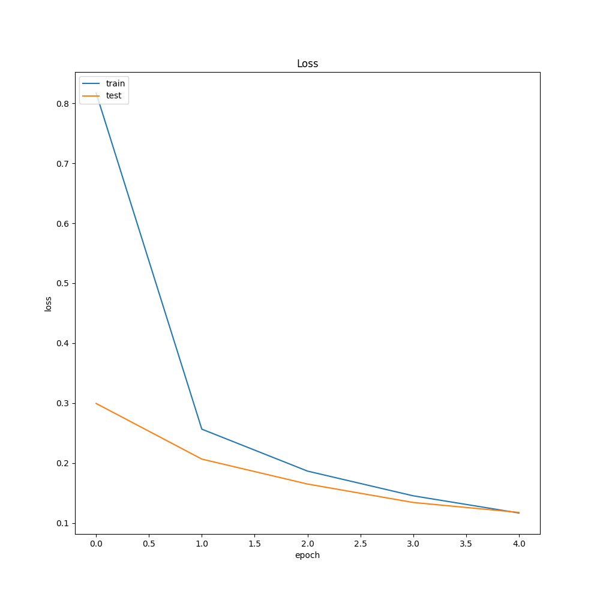
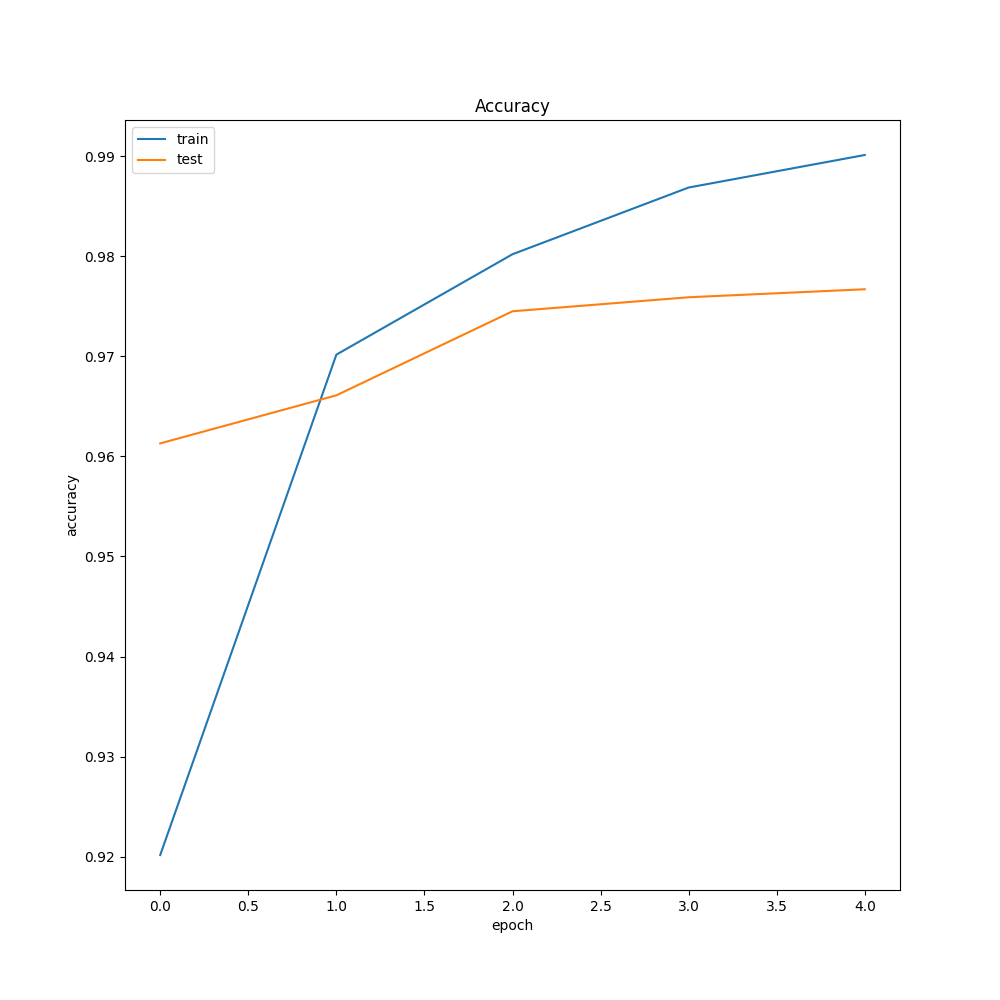
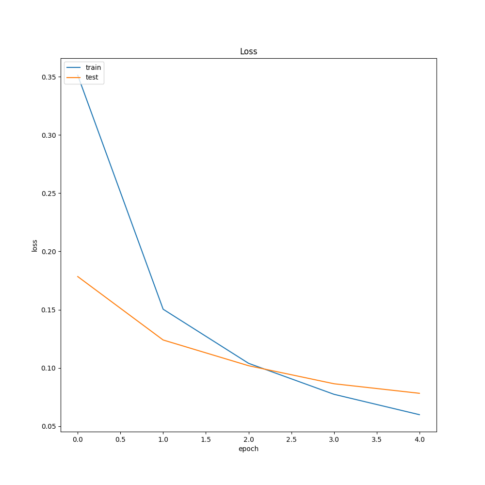

# Deep Learning Deep Learning
- A concise study on the hyperparameters of Deep Neural Networks
- Dataset used : MNIST
- Batch size : 256
- Optimizers : Adam, SGD
- Number of epochs : 5

## Deep Learning Model Descriptions
### Different Activation Functions:
- Model 1 :(784, input) -> (512, relu) -> (10, softmax)
- Model 2 :(784, input) -> (512, sigmoid) -> (10, softmax)
- Model 3 : (784, input) -> (512, tanh) -> (10, softmax)
- Explanation:
	- When comparing the use of different activation functions for hidden layers, we observe that
    the ReLU activation performs the best, followed by the tanh function and finally the sigmoid
    function. 
    - The reason for this is that sigmoid units tend to saturate and kill gradients, which
    is why it is never used in hidden layers; as it provides outputs between 0 and 1, it is suited as
    the output layer for binary classification problems only. Also, the outputs of the sigmoid function
    are not zero-centered. This is undesirable since neurons in later layers of processing in a neural
    network would be receiving data that is not zero-centered. This has implications on the dynamics during
    gradient descent, because if the data coming into a neuron is always positive (e.g. x>0 elementwise in 
    f=wTx+b)), then the gradient on the weights w will during backpropagation become either all be positive,
    or all negative (depending on the gradient of the whole expression f). This could introduce undesirable 
    zig-zagging dynamics in the gradient updates for the weights. 
    - Even though the tanh function saturates as well, it still performs relatively better than the sigmoid 
    function as it is zero-centered.
    - The ReLU activation performs best as it does not suffer from any such issues. We must note, however, 
    that the ReLU activation can lead to dead neurons - the gradient into a neuron can cause it to never
    activate for any input thereafter. Solutions to this include modifying the ReLU function to allow small
    negative values; we will not touch upon this here as we do not face this issue.

| Graph Type | Model 1 - ReLU - 1 Layer | Model 2 - Sigmoid - 1 Layer | Model 3 - Tanh - 1 Layer |
| :--------: | :-------: | :-------: | :-------: |
| Accuracy |  |  |  |
| Loss |  |  |  |
| Confusion matrix |  |  |  |

### Different number of hidden units per layer keeping numbers of layers and activation functions same:
- Model 4 : (784, input) -> (512, relu) -> (256, relu) -> (128, relu) -> (10, softmax)
- Model 5 : (784, input) -> (512, tanh) -> (256, tanh) -> (128, tanh) -> (10, softmax)
- Model 6 : (784, input) -> (512, sigmoid) -> (256, sigmoid) -> (128, sigmoid) -> (10, softmax)
- Explanation:
	- It can be observed here that in general, as the number of layers increases (the neural network
    becomes deeper), accuracy increases as well if the activation function is suited for the role. This
    is studied in more detail in the next section.
    - It is difficult to deterministically comment on the number of hidden units per layer in general. 
    This is because some applications benefit from having different numbers of neurons
    in subsequent layers, whereas others may benefit from having the same number of neurons in each
    hidden layer. The next section examines this in more detail.
    - We can also observe the effect of the choice of activation function in more detail here. We clearly
    observe that the ReLU function outperforms the tanh and sigmoid functions, while the sigmoid function
    performs even poorer than when it was used in the previous section (single hidden layer activation).

| Graph Type | Model 4 - ReLU - 3 Layer | Model 5 - Tanh - 3 Layer | Model 6 - Sigmoid - 3 Layer |
| :--------: | :-------: | :-------: | :-------: |
| Accuracy |  |  |  |
| Loss |  |  |  |
| Confusion matrix |  |  |  |

### Different number of layers:
- Model 7 : (784, input) -> (10, softmax)
- Model 8 : (784, input) -> (387, relu) -> (10, softmax)
- Model 9 : (784, input) -> (387, relu) -> (387, relu) -> (10, softmax)
- Model 10 : (784, input) -> (387, relu) ->  (387, relu) -> (387, relu) ->(10, softmax)
- Explanation:
	- Here, we can definitely observe that as the number of hidden layers increases, the accuracy also
    increases. We must note, however, that making a neural network too deep could also pose issues such as
    overfitting. Thus, some form of regularization is required to prevent this. Since we do not train for
    too long, we do not face this problem.
    - Having too many layers does not noticeably improve performance - it tapers off. This is because the ReLU
    activation allows the neural network to easily learn the identity function in deeper layers
    - We can also observe that having the same number of units in each layer does not noticeably
    improve performance compared to varying the number of units per layer. Again, we must note that this depends
    on the application - different data distributions may require different model architectures.

| Graph Type | Model 7 - 0 Layers | Model 8 - 1 Layer | Model 9 - 2 Layers | Model 10 - 3 Layers |
| :---------: | :---------: | :---------: | :---------: | :---------: |
| Accuracy |  |  |  |  |
| Loss |  |  |  |  |
| Confusion matrix |  |  |  |  |

### Different ordering of the hidden units sizes:
- Model 11 : (784, input) -> (128, tanh) -> (256, tanh) -> (512, tanh) -> (10, softmax)
- Model 12 :(784, input) -> (128, relu) -> (256, relu) -> (512, relu) -> (10, softmax)
- Explanation:
	- Here, we observe that increasing the number of hidden units per layer (essentially inflating the vector
    space) causes performance to drop.
    - This is because transforming data from a lower dimensional vector space to a higher dimensional space also
    involves the addition of either noise or sparsity, which reduces how effectively the neural network can learn
    the corresponding weights.
    - This also has a slight regularizing effect due to the noise; however, this type of model is not generally 
    recommended except for autoencoder architectures.

| Graph Type | Model 11 | Model 12 |
| :---------: | :---------: | :---------: |
| Accuracy |  |  |
| Loss |  |  |
| Confusion matrix |  |  |

### A note on choice of optimizer
- The optimizer used also plays an important role in determining how a neural network performs. This is because
the optimizer influences how the weights are adjusted, and thus the right optimizer can greatly speed up training
and improve accuracy.
- Here, we compare the Adam optimizer to the Stochastic Gradient Descent (SGD) optimizer.
- The results clearly show that for this application, Adam significantly outperforms SGD.
This is because Adam is an algorithm that computes adaptive learning rates for each parameter,
while SGD applies the same learning rate to all parameters, which can lead to SGD overshooting
the minima and taking longer to converge.
- The choice of optimizer also depends on the problem to be solved; several papers have demonstrated
that for some problems, SGD provides better generalization performance compared to Adam.

# ADD SOME SGD IMAGES HERE, RINGA

## Machine Learning models being compared to:
### Support Vector Machines
- Accuracy : 0.9833
- Optimal Hyperparameters : C -> 10, gamma -> 0.01, kernel -> rbf

| Graph Type | Support Vector Machine |
| :---------: | :---------: |
| Training & Cross-validation score |  |
| Confusion Matrix |  |
### Decision Trees
- Accuracy : 0.8868
- Optimal Hyperparameters : criterion -> entropy, max-depth -> None, min-samples-leaf -> 1, min-weight-fraction-leaf -> 0.0

| Graph Type | Decision Trees |
| :---------: | :---------: |
| Training & Cross-validation score |  |
| Confusion Matrix |  |
### Logistic Regression
- Accuracy : 0.9256
- Optimal Hyperparameters : penalty -> l2, solver -> lbfgs, max-iter -> 1000

| Graph Type | Logistic Regression |
| :---------: | :---------: |
| Training & Cross-validation score |  |
| Confusion Matrix |  |
### Random Forest
- Accuracy : 0.9698
- Optimal Hyperparameters : criterion -> gini, max-depth -> None, min-samples-leaf -> 1, min-weight-fraction-leaf -> 0.0, n-estimators -> 100

| Graph Type | Random Forest |
| :---------: | :---------: |
| Training & Cross-validation score |  |
| Confusion Matrix |  |
