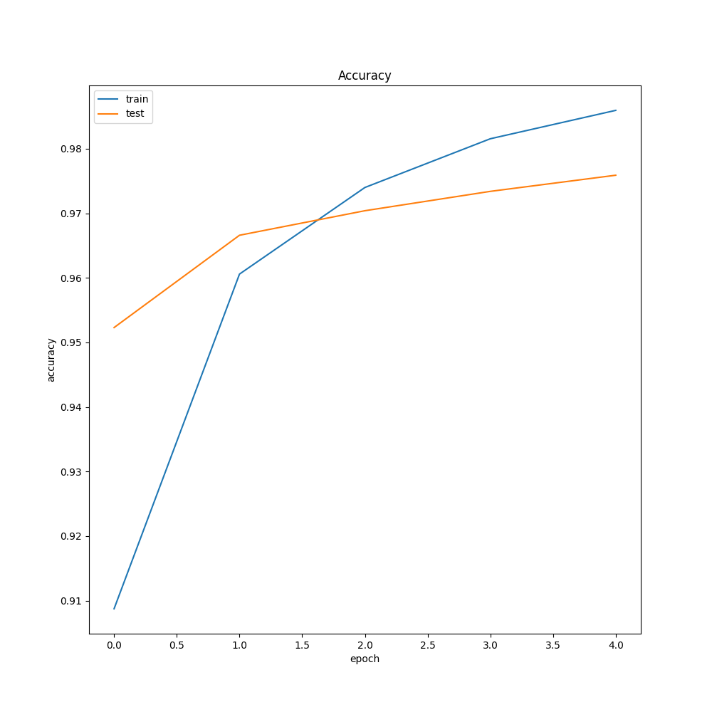
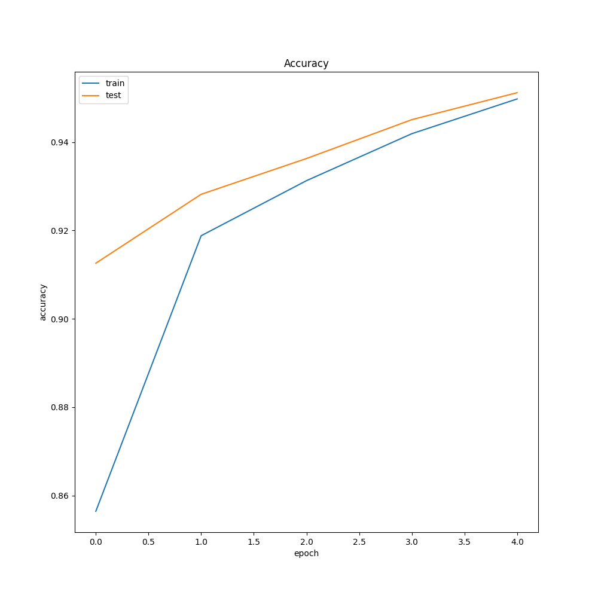
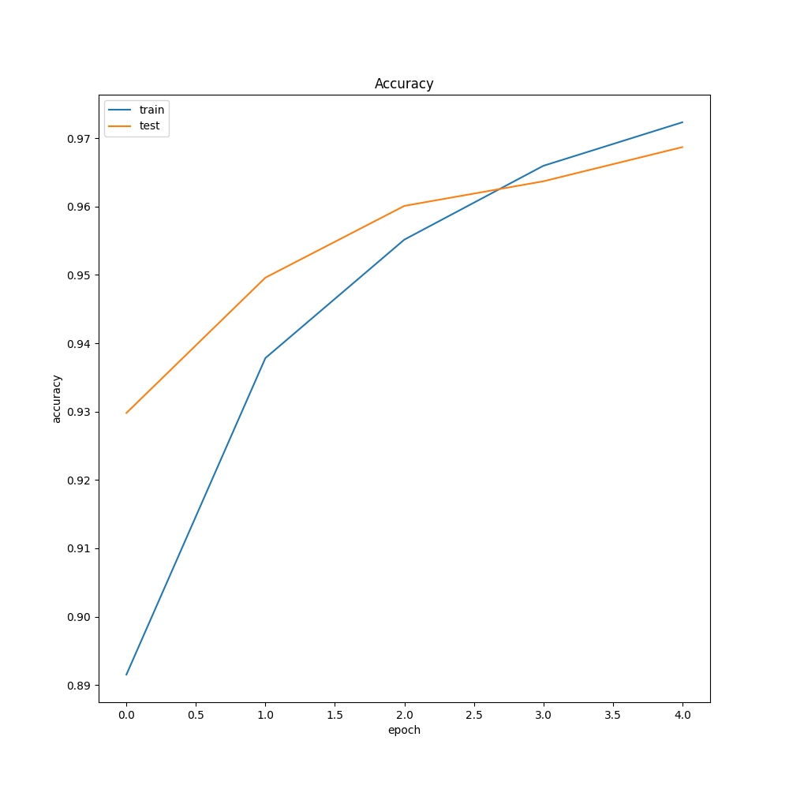
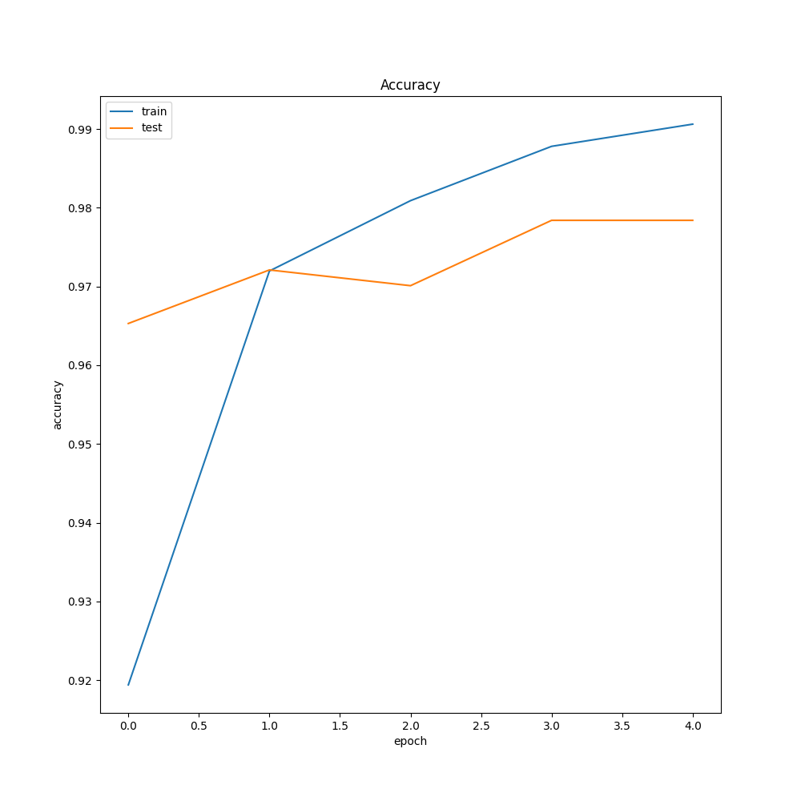
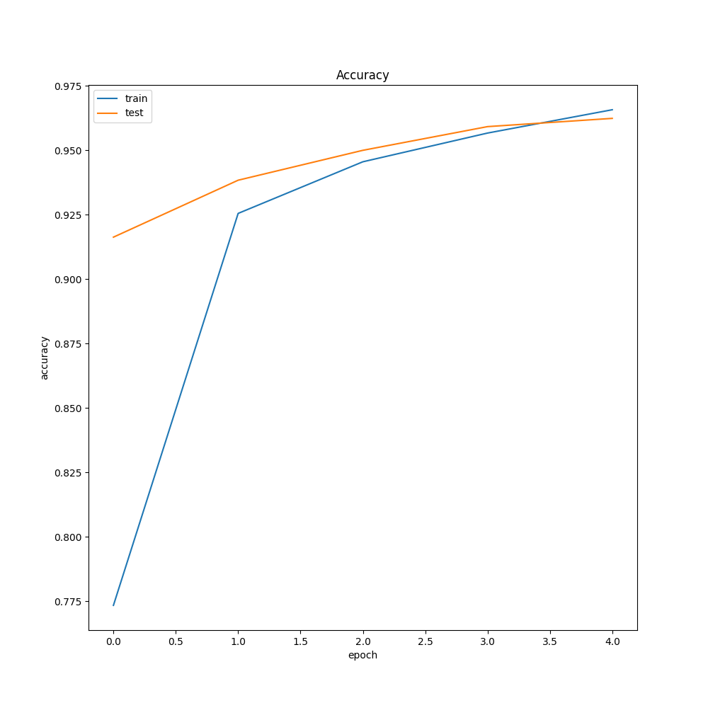
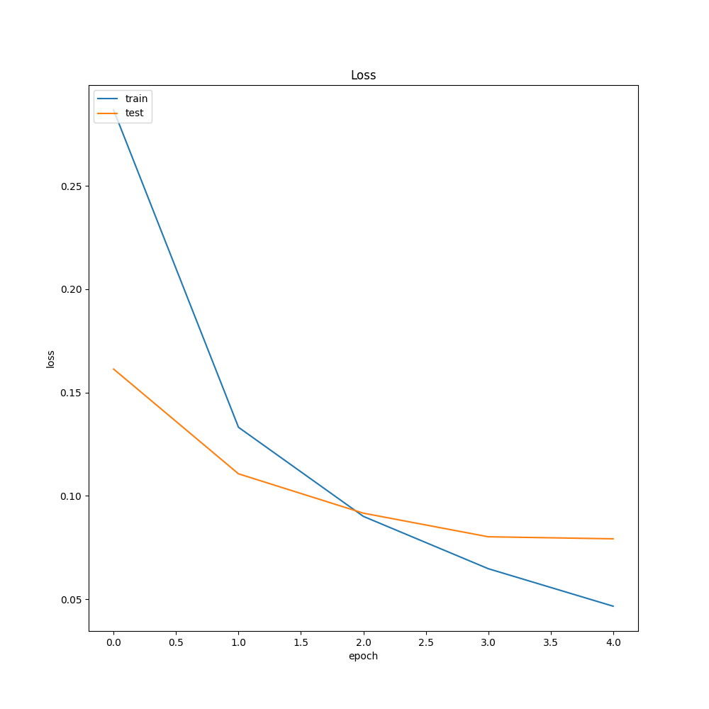
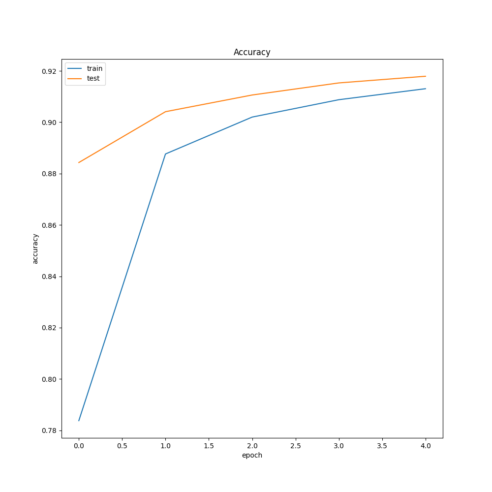

# Deep Learning Deep Learning
- A consice study on the hyperparameters of Deep Neural Networks
- Dataset used : MNIST
- Varying batch sizes are : 32, 64, 128, 256

## Deep Learning Model Descriptions
### Different Activation Functions:
- Model 1 :(784, input) -> (512, relu) -> (10, softmax)
- Model 2 :(784, input) -> (512, sigmoid) -> (10, softmax)
- Model 3 : (784, input) -> (512, tanh) -> (10, softmax)
- Explanation:
	- Lorem ipsum etc etc

| Graph Type | Model 1 - ReLU - 1 Layer | Model 2 - Sigmoid - 1 Layer | Model 3 - Tanh - 1 Layer |
| :--------: | :-------: | :-------: | :-------: |
| Accuracy |  |  |  |
| Loss |  |  |  |

### Different number of hidden units keeping numbers of layers and activation functions same:
- Model 4 : (784, input) -> (512, relu) -> (256, relu) -> (128, relu) -> (10, softmax)
- Model 5 : (784, input) -> (512, tanh) -> (256, tanh) -> (128, tanh) -> (10, softmax)
- Model 6 : (784, input) -> (512, sigmoid) -> (256, sigmoid) -> (128, sigmoid) -> (10, softmax)
- Explanation:
	- Lorem ipsum etc etc

| Graph Type | Model 4 - ReLU - 3 Layer | Model 5 - Tanh - 3 Layer | Model 6 - Sigmoid - 3 Layer |
| :--------: | :-------: | :-------: | :-------: |
| Accuracy |  |  |  |
| Loss |  |  |  |

### Different number of layers:
- Model 7 : (784, input) -> (10, softmax)
- Model 8 : (784, input) -> (387, relu) -> (10, softmax)
- Model 9 : (784, input) -> (387, relu) -> (387, relu) -> (10, softmax)
- Model 10 : (784, input) -> (387, relu) ->  (387, relu) -> (387, relu) ->(10, softmax)
- Explanation:
	- Lorem ipsum etc etc

| Graph Type | Model 7 - 0 Layers | Model 8 - 1 Layer | Model 9 - 2 Layers | Model 10 - 3 Layers |
| :---------: | :---------: | :---------: | :---------: | :---------: |
| Accuracy |  |  |  |  |
| Loss |  |  |  |  |

### Different ordering of the hidden units sizes:
- Model 11 : (784, input) -> (128, tanh) -> (256, tanh) -> (512, tanh) -> (10, softmax)
- Model 12 :(784, input) -> (128, relu) -> (256, relu) -> (512, relu) -> (10, softmax)
- Explanation:
	- Lorem ipsum etc etc

| Graph Type | Model 11 | Model 12 |
| :---------: | :---------: | :---------: |
| Accuracy |  |  |
| Loss |  |  |

## Machine Learning models being compared to:
### Support Vector Machines
- Add the confusion matrix and accuracy graph here.
### Decision Trees
- Add the confusion matrix and accuracy graph here.
### Logistic Regression
- Add the confusion matrix and accuracy graph here.
### Random Forest
- Add the confusion matrix and accuracy graph here.